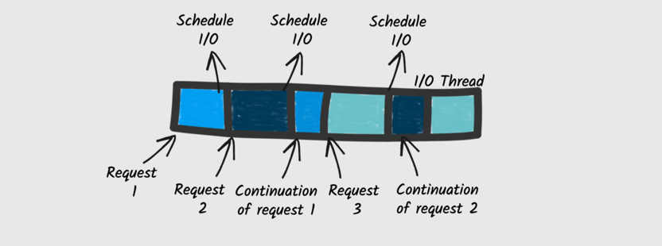

# Quarkus: Supersonic subatomic java for alle

Vi trenger minimum java 11. I dette prosjektet er target satt til 11, hvis du har tenkt å teste ut native kompilering (oppgave 2), 
bør ikke dette endres. Native kompilering støtter heller ikke minnedabaser, så oppgave 2 bør løses før oppgave 3.

**For å starte fra kommandolinjen:**
```
./mvnw clean compile quarkus:dev
```
Gå til http://localhost:9000/greeting/hello for å se at ting funker

### Info til de som ikke har mye erfaring med java
For de som ikke utvikler med java, så er oppgavene: 1, 3.1 og 3.2  nybegynnervennlige. 

Hvis man vil bruke VsCode så anbefales Extension Pack for Java.

## Oppgave 1: Rest, html og dependency injection

### Del 1: Oppvarming
1. Start appen fra kommandolinjen, og trykk på **r**, slik at alle tester kjøres kontinuerlig ved endring.
2. Gå til http://localhost:9000/greeting/hello for å se hva som dukker opp.
3. Endre teksten i GreetingResource til en valgfri, men hyggelig melding.
4. Refresh http://localhost:9000/greeting/hello og observer at teksten har endret seg helt uten at vi måtte kompilere eller starte appen på nytt!
5. Du skal ha nå fått en feilmelding i terminalen om at en test har feilet
6. Oppdater testen slik at det blir grønt igjen (for å trigge ny kjøring trykk på `ctrl s` eller `cmd s`)

Du har nå fått erfart Quarkus sin støtte for hotswapping av kode.

### Del 2: Faktisk lage noe
I denne oppgaven skal vi hente og vise data fra https://jsonplaceholder.typicode.com. Lag funksjonalitet slik at alle testene i `UserEndpointTest` blir grønne.

Alle testene er disabled, ta 1 test av gangen, fjern `@Disabled` og gjør den grønn. Man kan enten kjøre en og en test av gangen, eller bruke den kontinuerlige
kjøringen vist i Del 1.

### Del 3: Dependency injection
La oss se mer på dependency injection (DI). Når vi bruker Inject-annotasjonen så er det Quarkus sitt DI-system (Kalt ArC) 
som lager objektene og kontrollerer livssyklusen. Hva som er levetiden til et objekt kan settes på klassen med en annotasjon (hva ellers).

Gjør testene i `ValidationUserEndpointTest.java` grønne.

### Quarkus og testing
Testene i `UserEndpointTest` og `ValidationUserEndpointTest` bruker RestAssured til å kalle på http-endepunktene. Dette er supert for integrasjonstester, men det betyr at vi
er avhengig av at https://jsonplaceholder.typicode.com er tilgjengelig, og alltid gir det svaret vi forventer. Hvis man vil lese mer om hvordan vi mocker ut 
avhengigheter: https://quarkus.io/guides/getting-started-testing, spesielt https://quarkus.io/guides/getting-started-testing#further-simplification-with-injectmock

## Oppgave 2: Native kompilering
En av featurene til Quarkus er støtte for native kompilering, for å gjøre denne oppgaven må vi ha Docker installert og java 11 som target.

### Del 1: JVM
For å gi oss noe å sammenligne med begynner vi med å kjøre appen i JVM:
```
./mvnw package
java -jar target/quarkus-app/quarkus-run.jar
```
Legg merke til hva bygge- og startup-tiden er.


### Del 2: Native
For å lage en native executable trenger vi GraalVM. For å slippe installasjon av den bruker vi docker. Mer om GraalVM: https://quarkus.io/faq/#what-is-graalvm

**Linux:**
```
./mvnw package -Pnative -Dquarkus.native.container-build=true

./target/quarkus-intro-1.0.0-SNAPSHOT-runner
```


**Mac:**

Docker Desktop må kjøre, og vi må øke tilgjengelig minne (8GB skal holde)
```
./mvnw package -Pnative -Dquarkus.native.container-build=true -Dquarkus.container-image.build=true

docker build -f src/main/docker/Dockerfile.native -t quarkus-intro/native-app .

docker run -i --rm -p 9000:9000 quarkus-intro/native-app
```

Sammenlign bygge- og startup-tid og viftestøy med hva vi hadde for JVM. Siden vi bruker docker, vil første gang vi bygger bruke tid på å hente ned images.

## Oppgave 3: Datalagring
For å lagre data har Quarkus en extension som heter Panache: https://quarkus.io/guides/hibernate-orm-panache. Panache bygger på Hibernate, men med et mål om at
det skal være enklere å jobbe med entitetene.

I `application.properties` legg til:
```
quarkus.datasource.jdbc.url=jdbc:h2:mem:default
quarkus.datasource.db-kind=h2
quarkus.hibernate-orm.database.generation=drop-and-create
quarkus.hibernate-orm.log.sql=false
```

og opprett følgende klasser:

```java
package no.kantega;

import io.quarkus.hibernate.orm.panache.PanacheEntity;
import javax.persistence.*;
import java.util.*;

@Entity
public class Fruit extends PanacheEntity {
    public String name;

    @Enumerated(EnumType.STRING)
    public Taste taste;

    public Fruit(String name, Taste taste) {
        this.name = name;
        this.taste = taste;
    }

    public Fruit() {
    }

    public static List<Fruit> fruitsByTaste(Taste taste) {
        return new ArrayList<>();
    }

    public enum Taste {
        UNKNOWN,
        SWEET,
        SOUR,
        BITTER,
    }
}
```

----------------------------------------

```java
import io.quarkus.test.junit.QuarkusTest;
import no.kantega.Fruit;
import org.junit.jupiter.api.*;

import javax.transaction.Transactional;
import java.util.List;

import static org.junit.jupiter.api.Assertions.*;

@QuarkusTest
class FruitTest {

    @BeforeAll
    @Transactional
    public static void setup() {
        Fruit apple = new Fruit("Apple", Fruit.Taste.SWEET);
        Fruit otherApple = new Fruit("Apple", Fruit.Taste.SWEET);
        Fruit lemon = new Fruit("Lemon", Fruit.Taste.SOUR);
        Fruit grapeFruit = new Fruit("Grape fruit", Fruit.Taste.BITTER);

        apple.persist();
        otherApple.persist();
        lemon.persist();
        grapeFruit.persist();
    }

    @Test
    void getAllFruits() {
        List<Fruit> fruits = Fruit.listAll();

        assertTrue(fruits.size() > 0);
    }

    @Test
    @Transactional
    void changeExistingTaste() {
        var fruit = new Fruit("apple", Fruit.Taste.SWEET);

        // når man lager en ny entitet må man kalle persist()
        fruit.persist();
        // men alle endringer etter at eniteten er lagret vil skje automatisk
        fruit.taste = Fruit.Taste.BITTER;

        assertEquals(Fruit.Taste.BITTER, ((Fruit) Fruit.findById(fruit.id)).taste);
    }

    @Disabled
    @Test
    @Transactional
    void delete() {
        Long id = 2L;

        // TODO: Delete fruit

        assertNull(Fruit.findById(id));
    }

    @Disabled
    @Test
    void getAllFruitsByTaste() {
        List<Fruit> sourFruits = Fruit.fruitsByTaste(Fruit.Taste.SOUR);

        assertEquals(sourFruits.get(0).taste, Fruit.Taste.SOUR);
    }
}
```


### Del 1
Fullfør testene i no.kantega.FruitTest. Hvis man vil se den genererte SQLen så kan man endre på `quarkus.hibernate-orm.log.sql` i `applications.properties`.
Lesestoff: https://quarkus.io/guides/hibernate-orm-panache

### Del 2
Utvid Fruit med et felt som sier noe om kvaliteten på frukten. Det må også være mulig å finne frukt med ønsket kvalitet.

### Del 3
Quarkus bruker kodegenerering over reflection, noe man stort sett ikke må forholde seg til, Panache er ett tilfellene der
man kan se det i praksis: https://quarkus.io/guides/hibernate-orm-panache#defining-your-entity

Legg til testen
```
    @Test
    // Innholdet i testen under skal ikke endres på!
    void fruitShouldNormalizeName() {
        var orange = new Fruit();
        orange.name = "oRAnGe";

        assertEquals("Orange", orange.name);
    }
```


### Del 4: Ole har tre bananer, og to epler, han spiser en banan og gir det dårligste eplet til Kari, hvor mange frukter har Ole igjen?
Lag en Person-entitet som gjør det mulig å modellere dette komplekse problemet. Noen regler:
- En person kan ha mange frukter.
- En frukt kan ha ingen eller 1 Person som eier.
- Hvis en frukt blir spist opp, slettes den fra databasen.

Hvis du må google, så husk at Panache er Hibernate.

## Oppgave 4: Dev-UI
Quarkus har også et dev-ui: http://localhost:9000/q/dev, der man kan få litt ekstra informasjon om appen. Ta en titt rundt
for å se om det er en nyttig feature, eller om bare en gimmick. Bruk feks Config-editoren til å endre på noen valgfrie settings.

## Oppgave 5: Reactive
Før vi begynner med hva som menes med Reactive, kan det være greit å beskrive et scenario der det kan være et nyttig verktøy.

### Hente topp-saker fra Hacker News
Vi ønsker å lage et api som henter de beste sakene (med innhold) fra Hacker News (HN), med et query parameter som sier hvor mange saker vi vil
hente, f.eks: http://localhost:9000/hn/top-stories/details?first=10

HN har ett endepunkt som gir alle IDene: https://hacker-news.firebaseio.com/v0/topstories.json, og et endepunkt som gir innholdet til en gitt sak:
`https://hacker-news.firebaseio.com/v0/item/{id}.json`.

En enkel implementasjon vil være å hente IDene, iterere gjennom dem og gjøre et kall per ID for å hente innholdet. Ulmepen med dette
er at koden blokkeres ved hvert kall og responstiden vil øke med antall saker vi ønsker å hente.
I et tradisjonelt rammeverk har vi også en tråd per request og vi trenger da mange tråder hvis det er stor trafikk. 
Dette gir økt minne- og CPU-forbruk, tid brukt på tråd-switching og en risiko for at vi har flere requests enn tråder tilgjengelig.

Reactive er en løsning på dette problemet, hvis vi i vanlig synkron stil gjør et I/O-kall, blokkeres tråden mens vi venter på svar. Med Reactive brukes en 
annen modell. Når vi gjør I/O, registrerer vi en event-callback som kalles når vi har fått svar, og vi trenger derfor ikke å blokkere (dette er ganske 
likt Nodejs før async/await). Vi vil da klare oss med langt færre tråder siden de aldri blokkerer. Noe som sparer ressurser og tid, og vi risikerer heller 
ikke å få flere requests enn det er tråder tilgjengelig.

**Synkron**


**vs Reactive**



Hvis man ønsker å lese mer: https://quarkus.io/guides/getting-started-reactive

### Del 1: Vanlig kode
For å gi oss et sammenligningsgrunnlag lager vi først HN-Apiet med vanlig synkron java-kode
Lag endepunkt A og B som er beskrevet i `hn-api.http`, med JAX-RS og RestClient for å hente data. Klassen `Item.java` matcher det som kommer fra `/v0/item/{id}.json`

### Intermission : Intro til Mutiny og Reactive extensions
Quarkus skryter på seg førsteklasses støtte for Reactive programmering. Dette gjøres med egne extensions og bruk av Mutiny til å lage reactive kode. Mutiny baserer seg på to typer
`Uni` og `Multi`. Se unit-testen `MutinyTest` for å bli kjent med apiet, eller les mer om det her: https://quarkus.io/guides/mutiny-primer og https://smallrye.io/smallrye-mutiny/

Med Quarkus kan vi mikse reactive og vanlig kode. En restclient eller JAX-RS-klasse kan både ha metoder som returnerer vanlige typer og metoder som returnerer `Uni` eller `Multi`, og
de sistnevte vil ikke blokkere. Vi kan derimot ikke blande reactive og synkrone extensions. Vi må derfor fjerne de gamle når vi legger til de reactive variantene.

Fjerner de gamle:
```
./mvnw quarkus:remove-extension -Dextensions="quarkus-rest-client-jackson,quarkus-rest-client,quarkus-resteasy,quarkus-resteasy-jackson,quarkus-resteasy-qute"
```

og legger til nye:
```
./mvnw quarkus:add-extension -Dextensions="quarkus-resteasy-reactive-jackson, quarkus-rest-client-reactive-jackson, quarkus-resteasy-reactive, quarkus-rest-client-reactive, quarkus-resteasy-reactive-qute"
```


### Del 2
Lag endepunkt C beskrevet i `hn-api.http`, med de reactive variantene av JAX-RS og RestClient.

For rest-klienten er det bare å returnere `Uni<List<Long>>` for kallet som henter IDer, og tilsvarende for api-endepunktet.

Vi trenger ikke å kalle `subscribe()` på hverken `Uni` eller `Multi`. Det er bare å returnere de fra en restclient- eller JAX-rs-metode, så vil Quarkus håndtere det.

### Del 3: All together now
Endepunkt D blir litt mer tricky. Metoden på rest-clienten som henter en gitt sak kan returnere `Uni<Item>`. Api-endepunktet kan returnere `Mulit<Item>`. Vi deler det opp i flere steg

1. Først må vi hente ønsket antall IDer: `Uni<List<Long>>`
2. Vi må transformere fra `Uni<List<Long>>` til `Multi<Long>` slik at vi kan gjøre et kall per ID.
3. Hver ID må transformeres til `Uni` slik at vi kan hente `Item` fra HN,
4. Merge alt til `Multi<Item>`

Vi kan lese om transformering her: https://smallrye.io/smallrye-mutiny/getting-started/transforming-items-async, eller ta en titt på `MutinyTest.multi()`. 
 